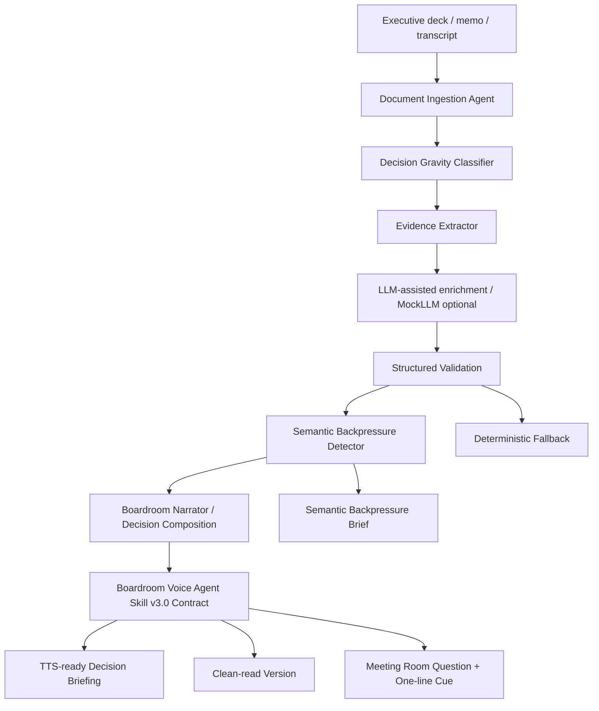

# Architecture: BoardroomVoiceAgent

## High-Level System Diagram

## Module Responsibilities

- **`src/ingestion.py`**: Normalizes input markdown files into a `DocumentContext`.
  > **Multimodal Extension Note:** If extending this pipeline with Vision/OCR capabilities (e.g., extracting text from slide images), a Human-in-the-Loop (HITL) confirmation step MUST be implemented before ingestion. The pipeline assumes input text is 100% human-verified ground truth. Unverified LLM vision output must not be passed directly into the ingestion agent.
- **`src/decision_gravity.py`**: Classifies whether the material has High, Medium, or Low decision gravity based on risk triggers.
- **`src/evidence_chain.py`**: Extracts the foundational `EvidenceChain` (Evidence, Insight, Conclusion, Choice).
- **`src/llm_interface.py`**: Provider-agnostic boundary that serializes MockLLM output and routes model responses through strict JSON parsing before semantic validation.
- **`src/schema_validation.py` / `src/schemas/evidence_schema.json`**: Dependency-free, purpose-built schema validation. The validator loads the real schema file and enforces the schema features used by this project; it is not a general-purpose Draft 2020-12 implementation and does not assess source faithfulness.
- **`src/structured_validation.py`**: Implements Semantic Role Integrity and Decision Topology Preservation for model and deterministic outputs.
- **`src/semantic_backpressure.py`**: The epistemic guardrail that evaluates if sufficient evidence exists to support the narrative, triggering halts if accountability or safety is missing.
- **`src/boardroom_narrator.py`**: Composes the TTS-ready script and enforces Spoken Decision Coherence under `script_tts_ready_skill_v3_0.md`.
- **`src/evaluation.py`**: Reports seven structural contracts and the three Minimal Boardroom Quality Gates.
- **`src/tracing.py`**: Collects observability data on LLM paths and validation triggers. It preserves `run_trace_latest.*` for convenience while also writing uniquely named per-run Markdown and JSON artifacts under `logs/runs/`.

## Handoff & Governance
- **`AGENTS.md`**: The global invariant harness. It mandates the **Human Accountability Lock** and prohibits certainty theater.
- **`script_tts_ready_skill_v3_0.md`**: The runtime skill containing exact TTS format expectations (`[PAUSE 3.0s]`).
- **Semantic Backpressure Flow**: If deterministic heuristic flags missing accountability, the LLM is physically incapable of clearing the flag.
- **LLM Fallback Flow**: If the LLM generates a fake strategic decision (e.g., "We recommend proceeding"), `structured_validation.py` intercepts the payload, marks `fallback_used`, and reroutes the extraction request back through the deterministic engine.
